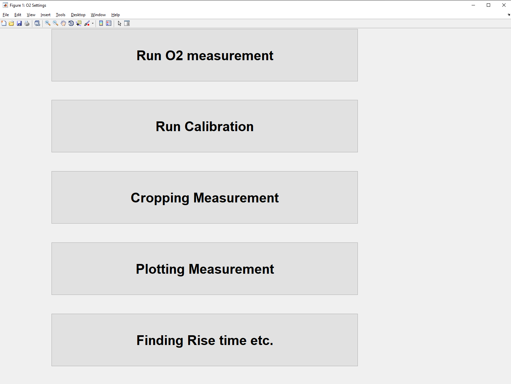
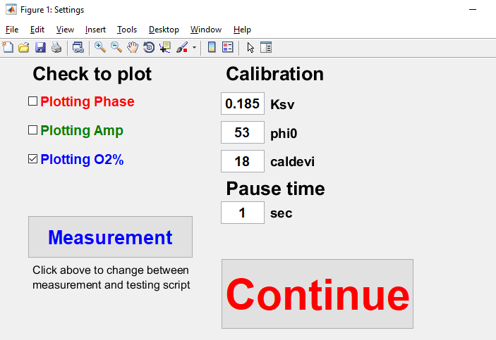
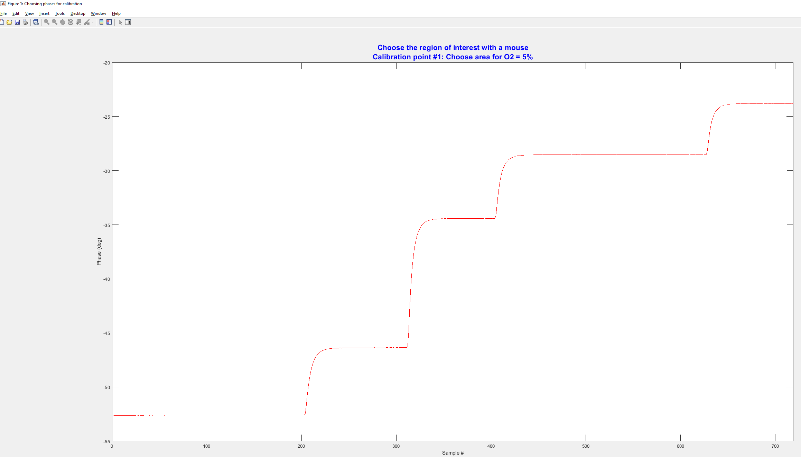
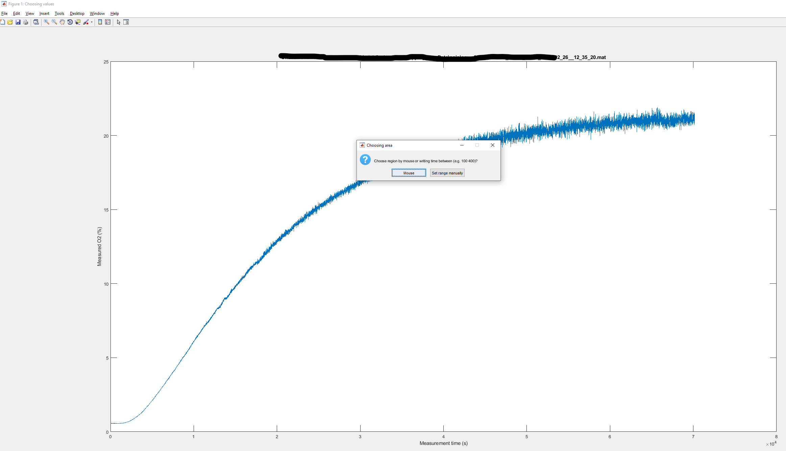
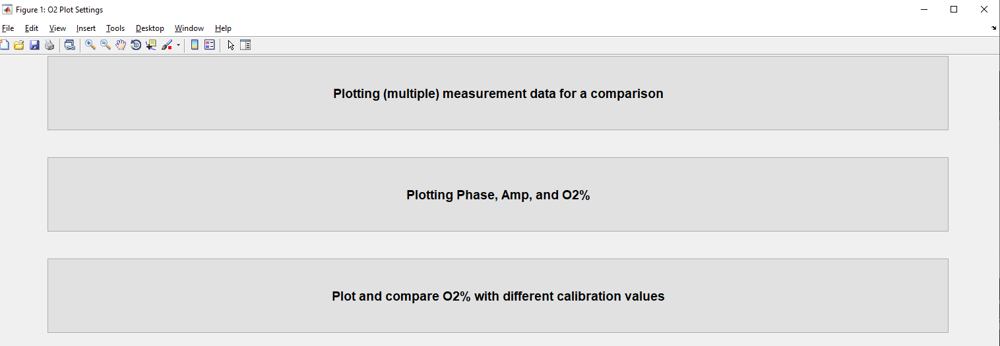
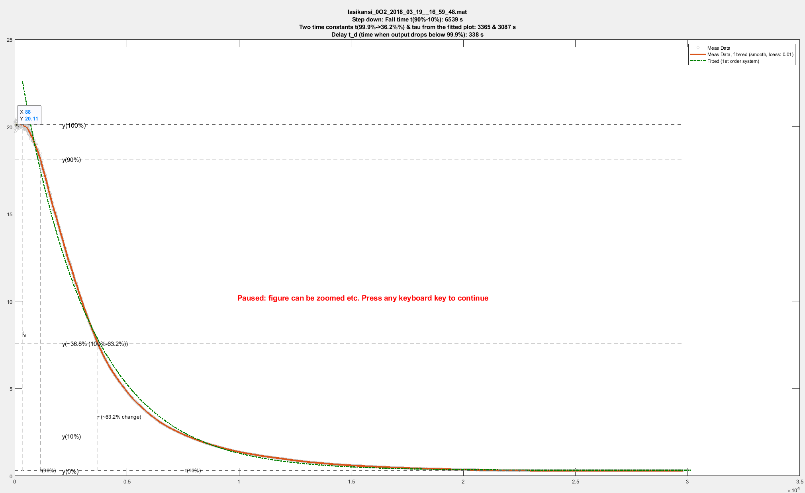

These MATLAB-functions are ofted used for oxygen measurement experiments in professor Pasi Kallio's Micro- and Nanosystems Research Group ([link](https://research.tuni.fi/mst/group/)).
Scripts should be updated to MATLAB Apps format. Maybe in one day...

# Choosing from the main figure
`O2_MAIN_ChoosingWhatToDo.m` opens window to choose what to do

Next, each possible choise is briefly presented

## Run O2 measurement
This will open window to start O2 measurement.

## Run Calibration
This will be used to run calibration.

## Cropping Measurement
This will be used to crop data

## Plotting Measurement
This will be used to plot different measurement data in different ways.

## Finding Rise time etc.
This will run functions that can be used to analyze measurement (step up or step down) properties.

# Acknowledgement
I would like to thank D.Sc. (Tech.) Hannu Välimaki to provide Stern-Volmer equation and O2 sensor calibration functions. 